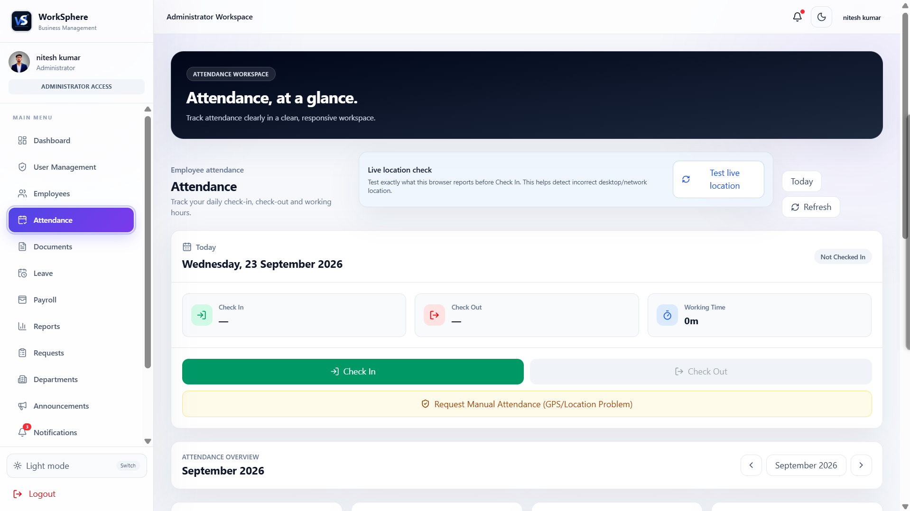
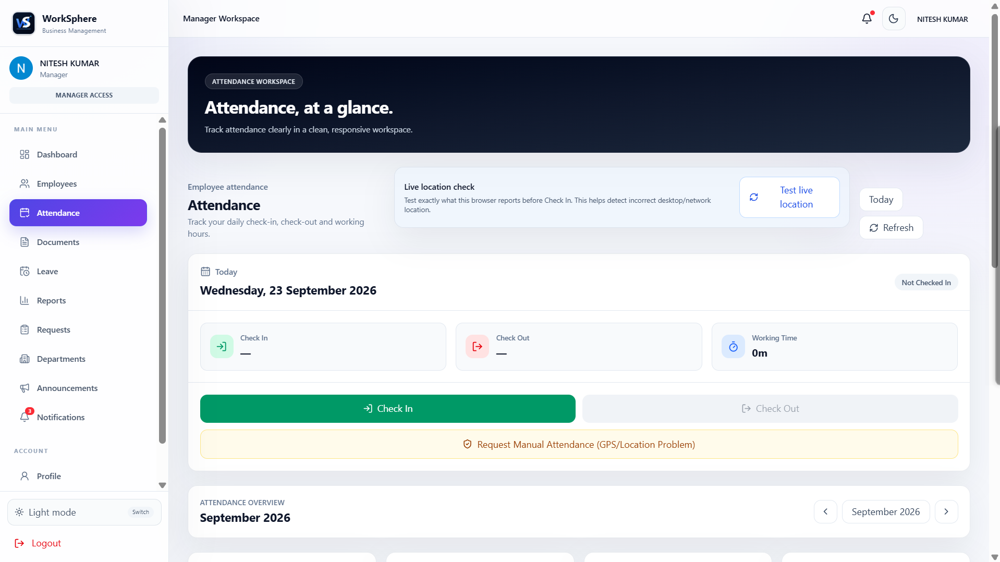
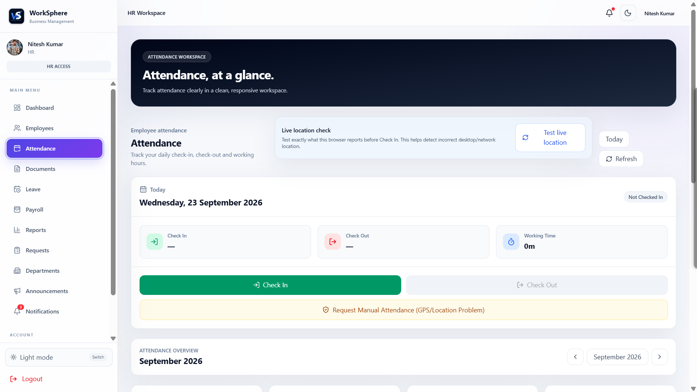
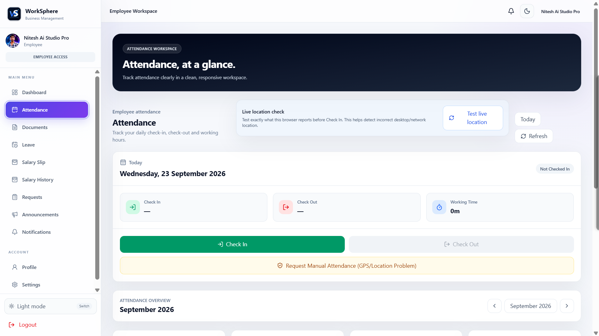

# 🚀 WorkSphere HRMS

<p align="center">
  <strong>A Role-Based Human Resource Management System</strong><br>
  Employee management • Attendance • Leave • Payroll • Salary Slips • Documents • Reports • Notifications
</p>

<p align="center">
  <a href="https://github.com/nitesh933438/WorkSphere-HRMS-Demo">GitHub Repository</a> •
  <a href="https://nitesh933438.github.io/WorkSphere-HRMS-Demo-Source/">Live Demo</a>
</p>

<p align="center">
  
</p>

<p align="center">
  <strong>Admin • HR • Manager • Employee</strong><br>
  Real-time, role-based HR operations with attendance geofencing, payroll, documents, requests and notifications.
</p>

---

# ✨ Highlights

- 🔐 **Role-based access** for Admin, HR, Manager and Employee
- 🕒 **Attendance management** with configurable office timing, working days and live-location geofencing
- 📍 **Live GPS diagnostics** showing detected coordinates, accuracy and distance from the configured office
- 📝 **Attendance/request workflows** for situations that require review or manual handling
- 💰 **Payroll management** with earnings, deductions, payable calculations and salary history
- 🧾 **Professional salary slips** with print and PDF-friendly output
- 🏖️ **Leave management** with role-aware review and approval workflows
- 📄 **Document management** with role-based visibility and Cloudinary-backed uploads when configured
- 📢 **Announcements** for company-wide communication
- 🔔 **Real-time notifications** for personal, company-wide and management audiences
- ✅ **Notification read state** with Mark as Read / Mark All as Read and per-user `readBy` synchronization
- 🔄 **Real-time notification badge** across supported pages, refreshes and sessions
- 📱 **Responsive UI + PWA support** for desktop, laptop, tablet and mobile experiences
- 🎨 **Consistent WorkSphere branding** with the WS application icon and favicon
- 🚀 **GitHub Actions + GitHub Pages** deployment workflow

---

# 🎬 Role-wise Demos

> Each role has its own dedicated workflow. GIFs are shown **one per line** so every role demo is easy to view.

## 👑 Admin Demo

<p align="center">
  
</p>

## 🧑‍💼 Manager Demo

<p align="center">
  
</p>

## 👩‍💼 HR Demo

<p align="center">
  
</p>

## 👨‍💻 Employee Demo

<p align="center">
  
</p>

---

# 📸 Role-wise Screenshots

> Every screenshot available in the project's `screenshots/` folders is included below. **Two screenshots are displayed per row.**

## 🔐 Authentication

<p align="center">
  
</p>

---

## 👑 Admin Screenshots

### 📊 Dashboard & Employee Management

<p align="center">
  
  
</p>

### 🏢 Departments & User Management

<p align="center">
  
  
</p>

### 🕒 Attendance & Leave Management

<p align="center">
  
  
</p>

### 📊 Reports & Documents

<p align="center">
  
  
</p>

### 📢 Announcements & Notifications

<p align="center">
  
  
</p>

### 📨 Requests & Profile

<p align="center">
  
  
</p>

### 💰 Payroll & ⚙️ Settings

<p align="center">
  
  
</p>

---

## 🧑‍💼 Manager Screenshots

### 📊 Dashboard & Employee Management

<p align="center">
  
  
</p>

### 🏢 Departments & Documents

<p align="center">
  
  
</p>

### 🕒 Attendance & Leave Management

<p align="center">
  
  
</p>

### 💰 Payroll & Reports

<p align="center">
  
  
</p>

### 📢 Announcements & Notifications

<p align="center">
  
  
</p>

### 📨 Requests & Profile

<p align="center">
  
  
</p>

### ⚙️ Settings

<p align="center">
  
</p>

---

## 👩‍💼 HR Screenshots

### 📊 Dashboard & Employee Management

<p align="center">
  
  
</p>

### 🏢 Departments & Documents

<p align="center">
  
  
</p>

### 🕒 Attendance & Leave Management

<p align="center">
  
  
</p>

### 💰 Payroll & Reports

<p align="center">
  
  
</p>

### 📢 Announcements & Notifications

<p align="center">
  
  
</p>

### 📨 Requests & Profile

<p align="center">
  
  
</p>

### ⚙️ Settings

<p align="center">
  
</p>

---

## 👨‍💻 Employee Screenshots

### 📊 Dashboard & Attendance

<p align="center">
  
  
</p>

### 🧾 Salary Slips & Documents

<p align="center">
  
  
</p>

### 🏖️ Leave Management & Requests

<p align="center">
  
  
</p>

### 📢 Announcements & Notifications

<p align="center">
  
  
</p>

### 💰 Payroll & 👤 Profile

<p align="center">
  
  
</p>

### ⚙️ Settings

<p align="center">
  
</p>

---

## 🧾 Salary Slip PDF

<p align="center">
  
</p>

---

# 👥 Role-Based Access

## 👑 Admin

Admin has the highest level of management access.

- Dashboard
- Employee management
- User and role management
- Department management
- Attendance management
- Leave management
- Payroll management
- Salary slips
- Reports
- Announcements
- Notifications
- Documents
- Requests
- Profile
- Company/system settings

## 🧑‍💼 Manager

Manager focuses on operational team management.

- Dashboard
- Team/employee visibility
- Department visibility
- Attendance monitoring
- Leave management
- Payroll visibility
- Reports
- Announcements
- Notifications
- Documents
- Requests
- Profile
- Settings

## 👩‍💼 HR

HR handles employee and HR operations.

- Dashboard
- Employee management
- Department management
- Attendance monitoring
- Leave management
- Payroll workflows
- Reports
- Announcements
- Notifications
- Documents
- Requests
- Profile
- Settings

## 👨‍💻 Employee

Employee access is limited to permitted personal and employee-level information.

- Personal dashboard
- Own attendance
- Check-in/check-out where permitted
- Own payroll information
- Salary history
- Salary slips
- Assigned documents
- Leave management
- Requests
- Announcements
- Notifications
- Profile
- Account settings

> Employees should not be able to modify management-controlled salary, payroll or company records.

---

# 📍 Attendance & Live Location

WorkSphere HRMS includes a configurable attendance policy designed for office-based attendance.

### Attendance policy

- Office start and end time
- Late-after time
- Break start and end time
- Working-day configuration
- Office latitude and longitude
- Attendance radius in meters
- Optional location requirement

### Live-location verification

When location-based attendance is enabled, the browser requests a fresh geolocation reading and the application checks the distance between the employee's live location and the configured office location.

The attendance experience also provides diagnostics for:

- Current latitude
- Current longitude
- Browser-reported GPS accuracy
- Distance from the configured office
- Allowed attendance radius
- Saved office coordinates

The location flow uses fresh readings and prefers the most accurate available reading to reduce stale/network-derived desktop location problems.

> Browser/device location permission and operating-system location services must be enabled for live GPS verification to work correctly.

---

# 🕒 Attendance → Payroll Workflow

```text
Employee
   ↓
Attendance
   ↓
Working / Payable Days
   ↓
Salary Calculation
   ↓
Earnings & Deductions
   ↓
Net Salary
   ↓
Salary Slip
```

---

# 💰 Payroll System

The payroll module provides a structured salary workflow.

### Payroll information can include

- Basic salary
- Earnings
- Allowances
- Deductions
- Attendance-related calculation
- Payable amount
- Net salary
- Payroll history

---

# 🧾 Salary Slip

WorkSphere HRMS provides professional salary-slip generation.

### Salary slip includes

- Company branding
- Company information
- Employee information
- Employee ID
- Department/designation
- Pay period
- Earnings
- Deductions
- Net salary
- Signature area
- Professional layout

### Output

- 🖨️ Print-friendly salary slip
- 📥 Downloadable PDF salary slip
- 📄 Automatic layout adjustment

---

# 🏖️ Leave Management

The system includes leave-management workflows for role-based leave operations.

- Apply/manage leave requests
- Review leave information according to role access
- Track leave status
- Role-aware leave controls

---

# 📢 Announcements & 🔔 Notifications

WorkSphere HRMS provides a role-aware, real-time communication system.

### Notification audiences

- 👤 **Personal** — delivered to a specific employee/user
- 🏢 **Company-wide** — visible to authorized users across the company
- 🧑‍💼 **Management** — available to Admin, HR and Manager users according to access rules

### Notification behavior

- Real-time Firestore synchronization
- Unread badge/count updates without waiting for a periodic refresh
- **Mark as Read** for individual notifications
- **Mark All as Read** for the current user
- Per-user read state for shared notifications through `readBy`
- Per-user dismissal state through `dismissedBy`
- New notifications appear in real time
- Read state remains synchronized after refresh/login and across supported sessions
- Role-aware notification visibility
- Notification links can open the relevant application area

This design keeps a shared company notification unread for other users while allowing each user to maintain their own read state.

---

# 📄 Document Management

- Upload documents
- View documents
- Download documents
- Manage employee documents
- Role-based access
- Cloudinary-backed file handling through the backend when configured

---

# 📨 Requests

The request module supports role-based employee and management request workflows.

- Create requests
- View requests
- Open request details
- Role-aware request access

---

# 📊 Reports

Management/HR reporting includes areas such as:

- Employee reports
- Attendance reports
- Leave reports
- Payroll reports
- Management summaries

---

# 🔐 Authentication & Security

WorkSphere HRMS uses Firebase authentication and role-aware application access.

- Firebase Authentication
- Firestore-based application data
- Role-based authorization
- Protected routes
- Restricted employee access
- Environment variables
- GitHub Actions deployment secrets

> Never commit real `.env` files or private credentials to the repository.

---

# 🛠️ Technology Stack

### Frontend

- React 19
- Vite
- JavaScript
- HTML5
- CSS3
- Tailwind CSS
- React Router
- Axios
- Lucide React / React Icons
- React Hot Toast

### Backend & Services

- Node.js
- Express
- Firebase Authentication
- Firebase Firestore
- Firebase Storage
- Cloudinary
- CORS
- Express File Upload
- Browser Geolocation API

### Deployment

- GitHub
- GitHub Pages
- GitHub Actions
- Render / deployed backend when configured

---

# 📁 Project Structure

```text
WorkSphere-HRMS/
├── public/
│   ├── favicon.svg
│   ├── icon.svg
│   ├── icon-192.png
│   ├── icon-512.png
│   ├── manifest.webmanifest
│   └── sw.js
│
├── src/
│   ├── components/
│   ├── config/
│   ├── constants/
│   ├── context/
│   ├── hooks/
│   ├── layouts/
│   ├── pages/
│   │   ├── announcements/
│   │   ├── attendance/
│   │   ├── auth/
│   │   ├── dashboard/
│   │   ├── departments/
│   │   ├── documents/
│   │   ├── employees/
│   │   ├── leaves/
│   │   ├── notifications/
│   │   ├── payroll/
│   │   ├── profile/
│   │   ├── reports/
│   │   ├── requests/
│   │   ├── settings/
│   │   └── users/
│   ├── services/
│   ├── utils/
│   ├── App.jsx
│   ├── index.css
│   └── main.jsx
│
├── backend/
│   ├── config/
│   │   └── cloudinary.js
│   ├── controllers/
│   │   └── cloudinaryController.js
│   ├── routes/
│   │   └── cloudinaryRoutes.js
│   ├── services/
│   │   └── cloudinaryService.js
│   ├── .env.example
│   ├── package.json
│   └── server.js
│
├── screenshots/
│   ├── gifs/
│   │   ├── admin-demo.gif
│   │   ├── manager-demo.gif
│   │   ├── hr-demo.gif
│   │   └── employee-demo.gif
│   ├── auth/
│   │   └── login.png
│   ├── admin/
│   ├── manager/
│   ├── hr/
│   ├── employee/
│   └── pdf/
│
├── scripts/
│   ├── audit-release.mjs
│   └── sync-version.mjs
│
├── .github/
│   └── workflows/
│       └── pages.yml
│
├── .env.example
├── firebase.json
├── index.html
├── package.json
├── vite.config.js
└── README.md
```

---

# 📸 Screenshot Inventory

The repository includes role-wise visual documentation under `screenshots/`.

- 🔐 Authentication
- 👑 Admin
- 🧑‍💼 Manager
- 👩‍💼 HR
- 👨‍💻 Employee
- 🧾 Salary-slip PDF preview
- 🎬 Role-wise GIF demos

The screenshot section above intentionally keeps the role structure and displays **two screenshots per row** wherever two assets are available.

> Keep screenshot filenames aligned with the paths referenced in this README when adding or replacing visual documentation.

---

# ⚙️ Local Setup

## 1. Clone the repository

```bash
git clone https://github.com/nitesh933438/WorkSphere-HRMS-Demo.git
cd WorkSphere-HRMS-Demo
```

## 2. Install frontend dependencies

```bash
npm install
```

## 3. Configure frontend environment variables

Create a local `.env` file using `.env.example`:

```env
VITE_FIREBASE_API_KEY=your_firebase_api_key
VITE_FIREBASE_AUTH_DOMAIN=your_project.firebaseapp.com
VITE_FIREBASE_PROJECT_ID=your_firebase_project_id
VITE_FIREBASE_STORAGE_BUCKET=your_firebase_storage_bucket
VITE_FIREBASE_MESSAGING_SENDER_ID=your_messaging_sender_id
VITE_FIREBASE_APP_ID=your_firebase_app_id
VITE_API_BASE_URL=http://localhost:5000
```

## 4. Install backend dependencies

```bash
cd backend
npm install
```

## 5. Configure backend environment variables

Create `backend/.env` using `backend/.env.example`:

```env
CLOUDINARY_CLOUD_NAME=your_cloud_name
CLOUDINARY_API_KEY=your_cloudinary_api_key
CLOUDINARY_API_SECRET=your_cloudinary_api_secret
CLOUDINARY_FOLDER=worksphere/files
PORT=5000
```

## 6. Start the backend

From the `backend/` directory:

```bash
npm run dev
```

Or:

```bash
npm start
```

## 7. Start the frontend

Open a second terminal in the project root:

```bash
npm run dev
```

---

# 🧪 Release Checks

Before pushing a release, you can run:

```bash
npm run build
npm run audit:release
```

The build process also runs the version synchronization script through the `prebuild` hook.

---

# 🏗️ Production Build

```bash
npm run build
npm run preview
```

The project also provides release/deployment scripts through `package.json`.

---

# 🚀 GitHub Pages Deployment

The project contains a GitHub Actions workflow at:

```text
.github/workflows/pages.yml
```

Typical deployment flow:

```text
main
 ↓
GitHub Actions
 ↓
Install dependencies
 ↓
Build application
 ↓
dist/
 ↓
GitHub Pages
```

Required Firebase/API values should be configured as repository/environment secrets according to the deployment setup.

---

# ☁️ Cloudinary Backend

File uploads can be handled through the Node/Express backend and Cloudinary configuration.

```text
Frontend
   ↓
Express API
   ↓
Cloudinary
   ↓
Uploaded File URL
```

Backend files:

```text
backend/
├── config/cloudinary.js
├── controllers/cloudinaryController.js
├── routes/cloudinaryRoutes.js
├── services/cloudinaryService.js
└── server.js
```

> Keep Cloudinary credentials only in environment variables. Never commit secrets.

---

# 📱 PWA & Responsive Design

The application is built to work across:

- 🖥️ Desktop
- 💻 Laptop
- 📱 Mobile
- 📟 Tablet

The project also includes PWA assets and service-worker support:

- Web app manifest
- WorkSphere application icons
- Favicon
- Service worker
- Installable experience where the browser/platform supports PWA installation

> Installation behavior depends on browser and operating-system support. iOS Safari uses its own Add to Home Screen flow.

---

# 📱 Responsive Design


Designed for:

- 🖥️ Desktop
- 💻 Laptop
- 📱 Mobile
- 📟 Tablet

---

# 🔄 Complete System Flow

```text
Authentication
      ↓
Role Detection
      ↓
Role-Based Dashboard
      ↓
Employee / Team Management
      ↓
Attendance & Leave
      ↓
Payroll Calculation
      ↓
Salary Slip
      ↓
Documents / Requests
      ↓
Reports / Announcements / Notifications
```

---

# 🎯 Project Objectives

- Reduce manual HR work
- Centralize employee information
- Improve attendance management
- Simplify leave and payroll workflows
- Generate professional salary slips
- Provide role-specific access
- Improve management visibility
- Keep employee access controlled
- Centralize documents, requests and notifications

---

# 🔮 Future Improvements

- Advanced analytics
- Holiday calendar
- Automated payroll cycles
- Email salary-slip delivery
- Advanced audit logs
- More detailed dashboards
- Multi-company support
- Advanced HR reports

---

# 👨‍💻 Developer

### Nitesh Kumar

- GitHub: https://github.com/nitesh933438
- Project: https://github.com/nitesh933438/WorkSphere-HRMS-Demo

---

<div align="center">

**WorkSphere HRMS — Modern, role-based HR management with real-time workflows.**

[Live Demo](https://nitesh933438.github.io/WorkSphere-HRMS-Demo-Source/) • [GitHub Repository](https://github.com/nitesh933438/WorkSphere-HRMS-Demo)

</div>
